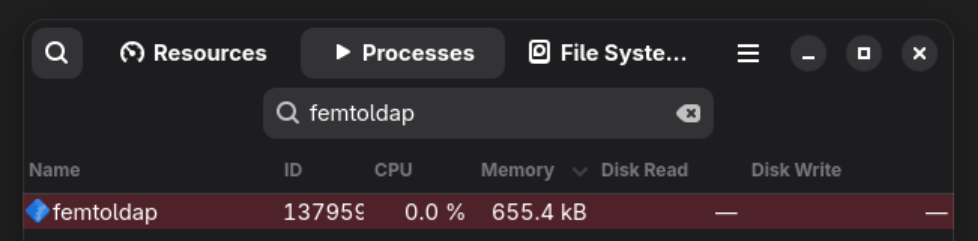

# femtoLDAP

## For those who almost rage-quit trying to configure OpenLDAP...

Let's be honest. You're here because you've wrestled with OpenLDAP.
You've stared into the abyss of trying to understand what has to go in `cn=config`.
You've tried to decipher cryptic error messages that seem to be written in ancient Sumerian.
You've probably considered sacrificing a goat to the server gods.

**You are not alone.**

femtoLDAP is here to offer sweet, sweet relief.
We feel your pain.
We *are* you.

This project is a tiny, stateless, in-memory LDAP server designed for those of us who just want something *simple* that *works* in *common usecases*.

## Features

* **Configuration? We Hardly Know Her!** (It's TOML, and it's readable by humans.)
* **Statelessness:** Because who needs the headache of persistent data when you can reload on every restart or SIGHUP? (Perfect for dev/test, or for those who live on the edge.)
* **Tiny Footprint:** It's "femto" for a reason. Probably.

Look at him!

* **Metrics:** Because if it's not emitting Prometheus metrics, is it even production-ready? (The answer is yes, but metrics are still nice.)
* **Written in Rust:** For that extra bit of reliability and speed, and because we like to suffer in our own way too.
* **AGPLv3 Licensed:** Because freedom is important, and also because we want to share the pain... I mean, the joy!

## Why femtoLDAP?

* **You value your sanity.**
* **You have better things to do than debug LDAP filters for the next three weeks.**
* **You just need a simple LDAP server for development, testing, or maybe a very small, very specific use case.**
  * SSO for your homelab? (may be or not be my usecase)
* **You've developed a twitch from looking at OpenLDAP documentation.**

## How It Works (Briefly, Because You Don't Care)

femtoLDAP reads your configuration, slurps it into memory, and pretends to be a real LDAP server according to a predetermined tree structure.
Think of it as an in-memory impostor with a good heart.

The tree, under your `base_domain` looks like this:

- **Apps** under `uid=<application_name>,ou=apps,<base_domain>`, which can bind and read all other entries, besides the details of other apps
- **Users** under `uid=<user_name>,ou=users,<base_domain>`, which can bind to themselves and read their attributes (a mixup of various popular schemas such as `inetOrgPerson`, `posixAccount` with popular attributes such as `mailAlias`, `sshPublicKey` and automatic `memberOf` generation)
- **Groups** under `cn=<group_name>,ou=groups,<base_domain>`, which are `groupOfUniqueNames` with `uniqueMember` childrens
- **Mail Aliases** under `cn=<mail_alias>,ou=aliases,ou=mail,<base_domain>`, which are `nisMailAlias` objects with `rfc822mailMember` childrens

See a demo for yourself using the [ldapsearch.sh](./integrations/ldapsearch.sh) on the example configuration.

## Usage

### Containerized

We host a pre-built container image at `ghcr.io/gabibbo97/femtoldap`.

### Native

1. **Install Rust**
2. **Clone this repo.** (Or download it, if you're into that sort of thing)
3. **Build it.** (`cargo build --release`)
4. **Configure it.** (Edit that lovely TOML file, see an example at [config.toml](config.toml))
5. **Run it!** (`./target/release/femtoldap server`)
6. **Breathe a sigh of relief.** (You deserve it)

## Contributing

Contributions are welcome!
Especially if you have a good sense of humor and/or experience with LDAP (keep this femto!).
Please.

## License

This project is licensed under the AGPLv3 license, sorry companies.
See [LICENSE](./LICENSE) for details.

## Disclaimer

femtoLDAP is provided "as is," without any warranty (expressed or implied).
We are not responsible for any existential crises you may experience upon realizing how much time you've wasted on OpenLDAP in the past.
Use at your own risk.
